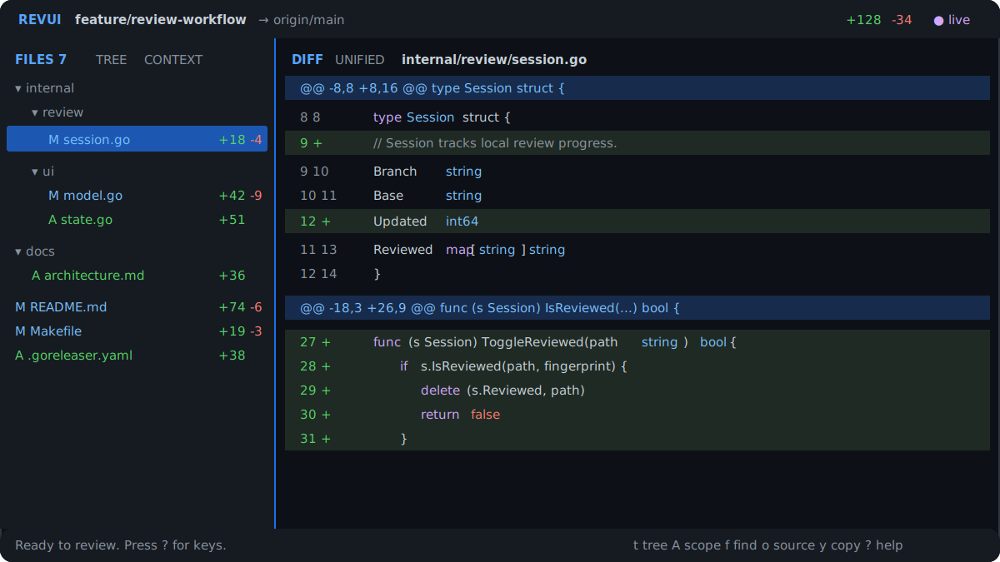

# revui

[](https://github.com/TenaciousMaker/revui/actions/workflows/ci.yml)
[](https://pkg.go.dev/github.com/TenaciousMaker/revui)
[](LICENSE)

**Review your PR before it's a PR.**

revui is a local terminal interface for reviewing a Git branch. It provides a changed-file browser, unified and split diffs, full-file source, repository search, reviewed-file tracking, and location-aware clipboard output.

<p align="center">
  
</p>

revui makes no network requests and does not modify working-tree files, commits, branches, or remotes.

## Install

Download a macOS or Linux archive from [GitHub Releases](https://github.com/TenaciousMaker/revui/releases), extract it, and place `revui` on your `PATH`.

With Go 1.25 or newer:

```sh
go install github.com/TenaciousMaker/revui/cmd/revui@latest
```

From source:

```sh
git clone https://github.com/TenaciousMaker/revui.git
cd revui
make build
./revui --version
```

## Quick start

Run revui anywhere inside a Git repository:

```sh
revui
```

revui compares the current branch with the merge base of the detected default branch. The review includes committed, staged, unstaged, renamed, deleted, binary, and untracked changes.

Specify a base revision when automatic detection is not appropriate:

```sh
revui --base origin/develop
```

Typical workflow:

1. Move through files and diff rows with `j`/`k`, arrow keys, or the mouse.
2. Press `t` for a directory tree. Press `A` to cycle changed, context, and all-files scopes.
3. Press `s` for split view or `o` for the complete file.
4. Select a `⋯` row and press `x` or Enter to expand unchanged lines between hunks. The row is also clickable.
5. Press `f` to search text across the repository.
6. Press `space` to mark the selected file reviewed, or `r` to mark every changed file reviewed.
7. A reviewed file changed afterward is marked `↻`. Press `u` to view only changes made since the last review.
8. Press `y` to copy the current line or selected range with its file and source location.

## Capabilities

- Merge-base branch review including working-tree and untracked changes
- Flat, tree, changed-only, contextual, and all-files navigation
- Unified and split diffs with syntax and intraline highlighting
- Expandable unchanged context between individual hunks
- Complete working-file source and base source for deleted files
- Fuzzy changed-file jump and repository-wide literal text search
- Reviewed-file progress with changes-since-review comparison
- Keyboard and pane-constrained mouse selection
- Accelerated mouse-wheel scrolling
- OSC52 clipboard output with repository-relative path and source lines
- Automatic repository refresh with manual `R` fallback
- `NO_COLOR` support with non-color status markers

## Keys

| Key | Action |
| --- | --- |
| `j` / `k`, arrows | Move through files or code rows |
| Mouse click / wheel | Position the active row or scroll the pane under the pointer |
| Mouse drag | Select visible code inside one pane |
| `tab`, `h` / `l` | Switch panes or navigate tree folders |
| `t` | Toggle flat and tree file layouts |
| `A` | Cycle changed, context, and all-files scopes |
| `w` | Fit or restore the file-pane width |
| `enter` | Open a file or folder; expand a selected `⋯` diff row |
| `/` | Fuzzy-jump to a changed file |
| `f` | Search text across the repository |
| `o` | Toggle complete source and diff |
| `s` | Toggle unified and split diff |
| `x` | Expand the selected `⋯` region between hunks |
| `[` / `]` | Jump to the previous or next hunk |
| `i` | Toggle whitespace-only changes in the raw diff |
| `e` | Toggle semantic highlighting |
| `n` | Toggle normalized structural layout in split view |
| `d` | Toggle optional Difftastic structural split |
| `space` | Toggle reviewed state for the selected changed file |
| `r` | Mark all changed files reviewed; clear all when every file is current |
| `u` | Toggle changes since the selected file's last review |
| `v`, then move | Define a code range |
| `y` | Copy the current line or selected range with location |
| `R` | Refresh from Git |
| `?` | Show the complete keymap |
| `q` | Quit |

Search fields support arrow keys, Home/End, `ctrl+a/e`, `ctrl+b/f`, `ctrl+u/k`, `ctrl+w`, Backspace/Delete, and bracketed paste.

## Diff modes

- Raw diff is the default and follows Git's hunk layout.
- `i` hides whitespace-only changes in raw mode.
- `e` enables semantic highlighting. The header displays `AST` when a syntax parser is active and `TOKEN*` when token fallback is active.
- `n` enables normalized structural layout and split view. The header displays `NORMALIZED` when available and `NORM N/A` when the file cannot be normalized.
- `d` uses [`difft`](https://difftastic.wilfred.me.uk/) when the executable is available on `PATH`. Failure returns to the raw Git split with a visible warning.

Built-in syntax parsers cover TypeScript/TSX, JavaScript/JSX, Go, Python, Rust, Java, JSON, C, C++, and Ruby. Other file types use token highlighting.

## State and privacy

Global display preferences are stored in the operating system's user configuration directory:

- macOS: `~/Library/Application Support/revui/preferences.json`
- Linux: `${XDG_CONFIG_HOME:-~/.config}/revui/preferences.json`

The file layout, file scope, pane width, unified/split mode, whitespace filter, semantic mode, normalized layout, and Difftastic mode apply across repositories.

Reviewed-file fingerprints and local text baselines are stored under the repository's Git metadata at `.git/revui`. A `✓` indicates that the current diff matches the reviewed version. A `↻` indicates that the file changed afterward. Legacy review entries and binary files can be marked reviewed but do not provide a text comparison until a textual baseline is available.

Repository search uses `git grep` and respects Git ignore rules. revui does not transmit repository content.

## Clipboard

`y` uses the terminal's OSC52 clipboard protocol. Copied text contains the repository-relative file path, branch or base line range, and plain source without rendered line numbers or diff markers.

If OSC52 is disabled by the terminal or multiplexer, use terminal-native text selection and copy.

## Requirements

- macOS or Linux on amd64 or arm64
- Git
- An interactive ANSI terminal
- Go 1.25 or newer only when installing with `go install` or building from source

Mouse input and OSC52 support depend on the terminal. Every primary workflow has a keyboard equivalent.

## Troubleshooting

**Wrong comparison base:** run `revui --base <revision>`.

**Clipboard reports success but remains empty:** enable OSC52 in the terminal or multiplexer, or use terminal-native copy.

**Changes do not refresh:** press `R`. Some networked and virtual filesystems do not emit reliable filesystem events.

**Colors are difficult to distinguish:** run with `NO_COLOR=1`. Added/deleted markers, hunk headers, selected rows, and pane labels remain visible.

**Terminal is narrow:** use `tab`, `h`, or `l` to switch between the file and code panes.

Report reproducible problems with the [bug report form](https://github.com/TenaciousMaker/revui/issues/new?template=bug.yml).

## Contributing

```sh
make check
make test-race
make coverage
```

See [CONTRIBUTING.md](CONTRIBUTING.md), [SECURITY.md](SECURITY.md), and [the architecture guide](docs/architecture.md).

## License

[MIT](LICENSE)
